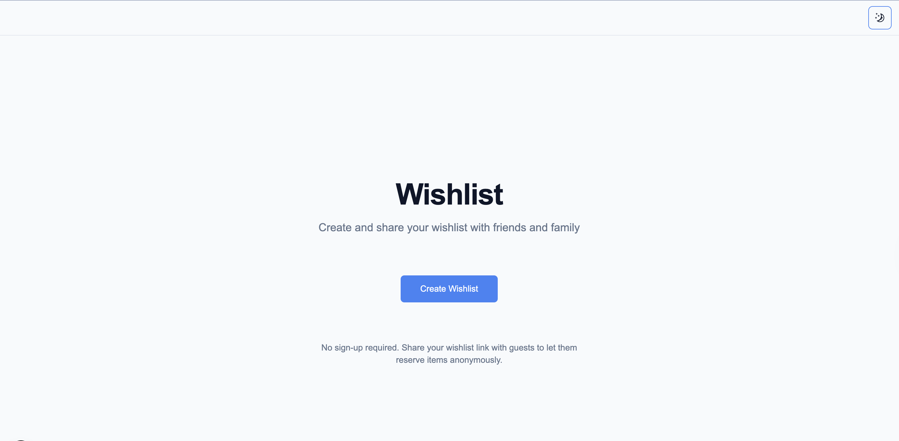
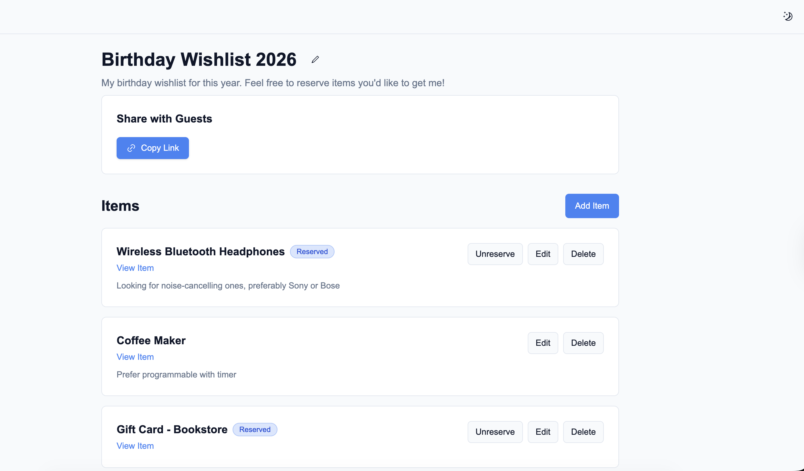
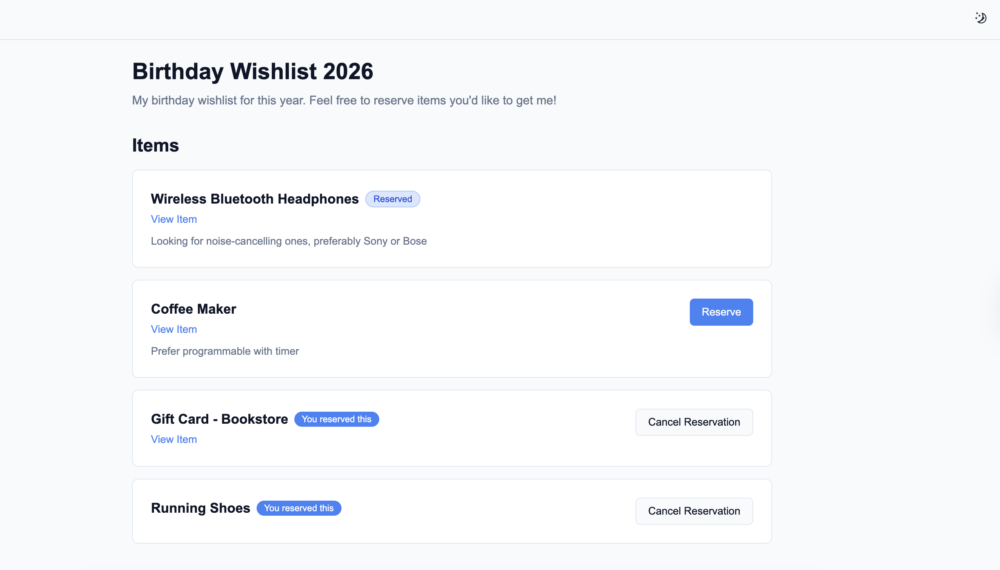
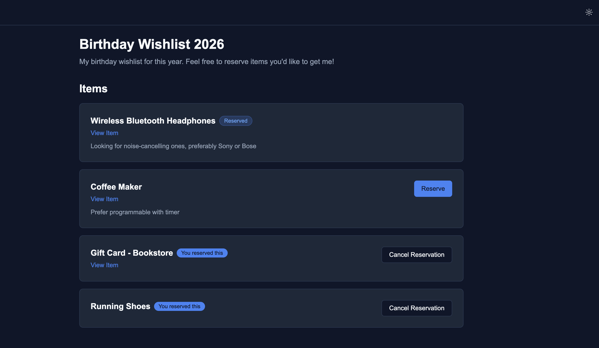

# Wishlist App

[](https://github.com/osanto/wishlist/actions/workflows/ci.yml?query=branch%3Amain)

A simple, anonymous wishlist web application where owners can create wishlists and share them with guests. Guests can reserve items anonymously without creating an account.

## Screenshots

### Homepage



### Admin View



### Guest View



### Dark Mode



## Features

### For Wishlist Owners (Admin)

- ✅ Create wishlist with unique admin and guest links
- ✅ Edit wishlist title and description
- ✅ Add, edit, and delete items
- ✅ View reservation status (see which items are reserved)
- ✅ Unreserve any item (override guest reservations)
- ✅ Copy guest link to share with others

### For Guests

- ✅ View wishlist items
- ✅ Reserve multiple items anonymously
- ✅ Cancel own reservations
- ✅ See reservation status:
  - "You reserved this" for items they reserved
  - "Reserved" for items reserved by others

### Additional Features

- ✅ Dark mode support (system preference detection)
- ✅ Toast notifications for all actions
- ✅ Responsive design
- ✅ Security headers configured
- ✅ Comprehensive test coverage (57 unit tests + 18 E2E tests)

## Tech Stack

### Frontend

- **Next.js** - React framework with App Router
- **React 19** - UI library
- **TypeScript** - Type safety
- **TailwindCSS** - Styling
- **ShadCN/UI** - Component library
- **next-themes** - Dark mode support
- **react-hook-form** - Form management
- **Zod** - Schema validation
- **Sonner** - Toast notifications

### Backend

- **Supabase** - PostgreSQL database and backend
- **Server Actions** - Next.js server-side mutations
- **Server Components** - Next.js server-side data fetching

### Testing

- **Vitest** - Unit testing
- **Playwright** - E2E testing

## Prerequisites

- Node.js 20+
- npm or yarn
- Supabase account (free tier works)

## Getting Started

### 1. Clone the Repository

```bash
git clone <https://github.com/osanto/my-wishlist.git>
cd wishlist
```

### 2. Install Dependencies

```bash
npm install
```

### 3. Set Up Supabase

1. Create a new project at [supabase.com](https://supabase.com)
2. Go to SQL Editor and run the schema from `docs/schema.sql`
3. Get your project URL and service role key from Settings → API

### 4. Configure Environment Variables

Create a `.env.local` file in the root directory:

```env
SUPABASE_URL=your_supabase_project_url
SUPABASE_SERVICE_ROLE_KEY=your_service_role_key
```

### 5. Run the Development Server

```bash
npm run dev
```

Open [http://localhost:3000](http://localhost:3000) in your browser.

## Available Scripts

- `npm run dev` - Start development server
- `npm run build` - Build for production
- `npm run start` - Start production server
- `npm run lint` - Run ESLint
- `npm run format` - Format code with Prettier
- `npm run format:check` - Check code formatting
- `npm test` - Run unit tests (Vitest)
- `npm run test:ui` - Run unit tests with UI
- `npm run test:e2e` - Run E2E tests (Playwright)

## Project Structure

```
wishlist/
├── app/                    # Next.js App Router
│   ├── actions/           # Server Actions
│   ├── admin/             # Admin pages
│   ├── guest/             # Guest pages
│   └── page.tsx           # Homepage
├── components/            # React components
│   ├── ui/                # ShadCN UI components
│   └── ...                # Feature components
├── lib/                   # Utilities and helpers
│   ├── supabase.ts        # Supabase client
│   ├── tokens.ts          # Token generation
│   ├── token-storage.ts   # localStorage utilities
│   └── wishlist.ts        # Wishlist helpers
├── tests/                 # Test files
│   ├── actions/           # Unit tests
│   └── e2e/               # E2E tests
└── docs/                  # Documentation
    ├── PRD.md            # Product requirements
    ├── Tech-Overview.md # Technical overview
    └── schema.sql       # Database schema
```

## Testing

### Unit Tests

Run unit tests with Vitest:

```bash
npm test
```

Or with UI:

```bash
npm run test:ui
```

### E2E Tests

Run E2E tests with Playwright:

```bash
npm run test:e2e
```

**Note:** E2E tests require the dev server to be running. Playwright will start it automatically.

## Security

- All Supabase calls happen server-side only
- Service role key never exposed to browser
- Tokens validated before every mutation
- Security headers configured (X-Frame-Options, HSTS, CSP, etc.)
- No personal data collected
- Anonymous reservations

## How It Works

1. **Wishlist Creation**: User clicks "Create Wishlist" → System generates unique admin and guest tokens → Redirects to admin page
2. **Token Storage**: Admin/guest tokens stored in URL (for routing) and localStorage (for persistence)
3. **Reservations**: Guests get a unique reservation token stored in localStorage → Used to track which items they reserved
4. **Access Control**: All mutations validate tokens server-side before executing

## License

MIT License
